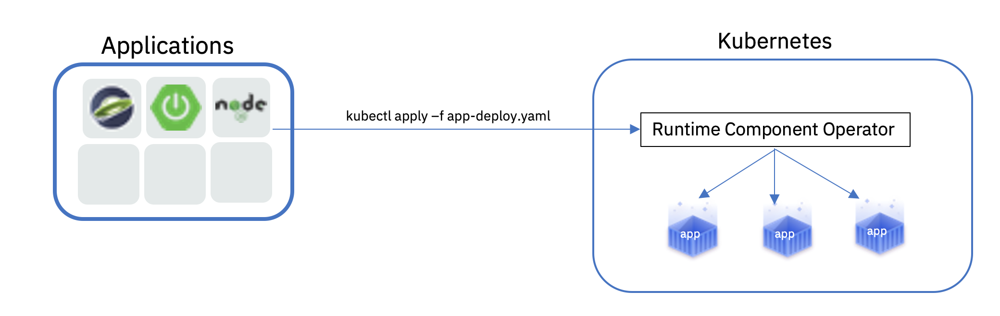

# Application Stacks Operator
This generic Operator is capable of deploying any application image with consistent, production-grade QoS.  It enables enterprise architects to govern the way their applications get deployed & managed in the cluster, while dramatically reducing the learning curve for developers to deploy into Kubernetes - allowing them to focus on writing the code!

Check out [our docs](https://github.com/application-stacks/operator/blob/master/doc/user-guide.md) to get started!

This Operator can also be imported into any runtime-specific Operator as library of application capabilities.  This architecture ensures compatibility and consistency between all runtime Operators, allowing everyone to benefit from the functionality added in this project.

Currently the projects that are importing this library are:
- Appsody Operator: https://github.com/appsody/appsody-operator
- Open Liberty Operator: https://github.com/OpenLiberty/open-liberty-operator
